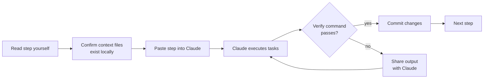
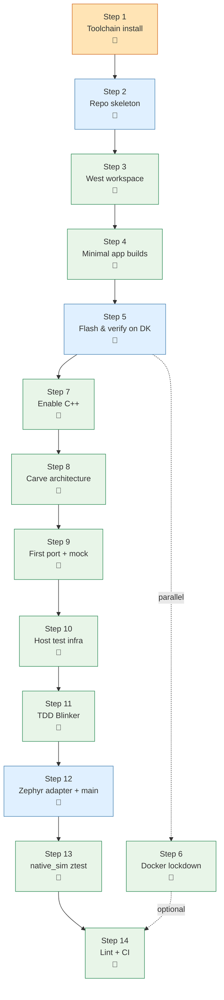
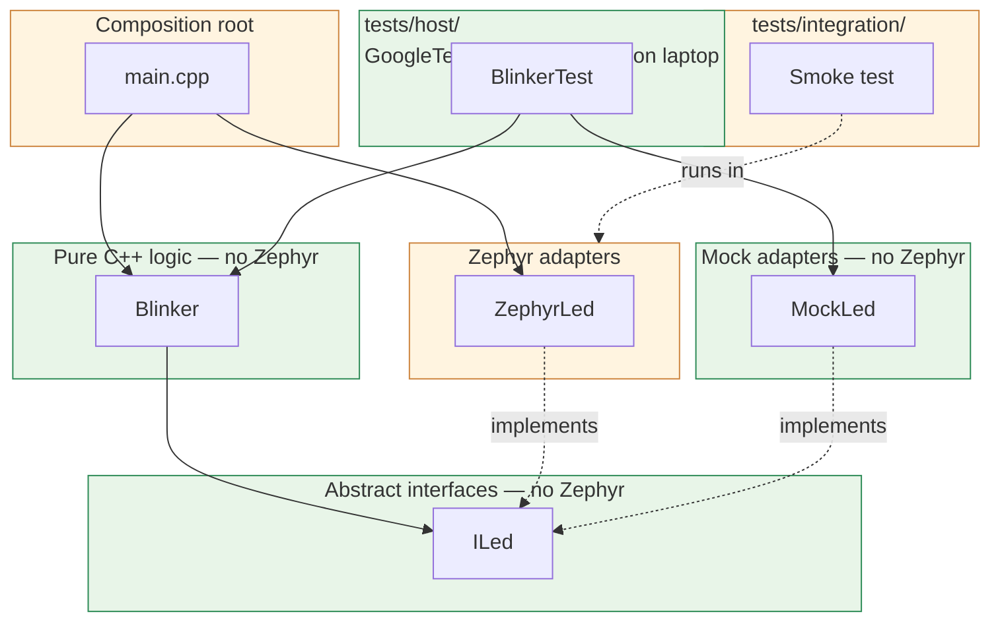
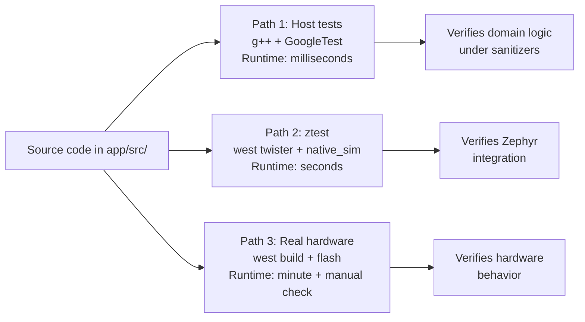
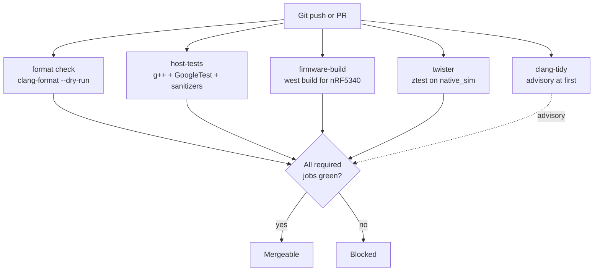

# Phase 0 — Foundation (Claude-executable)

**Goal:** Stand up a minimal but production-grade NCS C++ project that demonstrates the entire architectural pattern (ports / adapters / host tests / native_sim ztest / CI) on a single trivial vertical slice — a Blinker class. Every subsequent phase builds on this scaffolding without modifying it.

**Estimated time:** 1–2 focused days when executing with Claude (vs. 4–5 by hand).

**Hardware:** nRF5340 DK only.

## Status

| Step | Title | State |
|------|-------|-------|
| 1 | Toolchain install | done (host has NCS v3.2.4 via `nrfutil toolchain-manager`) |
| 2 | Repo skeleton | done |
| 3 | West workspace | done (`west.yml` pinned to v3.2.4) |
| 4 | Minimal app builds | done (build green for `nrf5340dk/nrf5340/cpuapp`) |
| 5 | Flash & verify on DK | done (LED + serial line confirmed by human) |
| 6 | Docker lockdown | done (`scripts/build.sh` runs `zephyrprojectrtos/ci@sha256:db4d04…`) |
| 7 | Enable C++ | done (`CONFIG_CPP` / `CONFIG_STD_CPP20`; ETL pinned at `modules/lib/etl`; libstdc++ headers re-exposed under MINIMAL_LIBCPP; flashed, serial confirmed) |
| 8 | Carve architecture | done (README in each of `domain/`/`ports/`/`adapters/zephyr/`/`adapters/mock/`; CMake globs `domain/*.cpp` and `adapters/zephyr/*.cpp`; `src/` on include path) |
| 9 | First port + mock | done (`ports/i_led.hpp`, `adapters/mock/mock_led.hpp`; both compile standalone with `g++ -std=c++20`) |
| 10 | Host test infra | done (`tests/host/CMakeLists.txt`; GoogleTest v1.15.2 via FetchContent; sanitizer build opt-in; configure verified) |
| 11 | TDD Blinker | done (4/4 host tests green; same green under ASan+UBSan; clang-tidy clean on `domain/blinker.cpp`) |
| 12 | Zephyr LED adapter + main | done (`adapters/zephyr/zephyr_led.hpp`; main.cpp composition root; flashed, LED1 blinks at ~1 Hz on the DK) |
| 13 | native_sim ztest | done (`tests/integration/blink/`; 1/1 passed under `west twister -p native_sim`) |
| 14 | Lint + format + CI | done (`.clang-format` + tree reformat; `.github/workflows/ci.yml` with five jobs; `.clang-tidy` already landed early) |

See [Plan deltas](#plan-deltas) for divergences from the original plan that were applied during execution.

---

## How to use this plan with Claude

Each step below is a discrete, self-contained unit you can hand off as a single prompt to Claude (Claude Code in your terminal, or IDE-integrated Claude). Steps are tagged by mode:

| Mode | Meaning |
|------|---------|
| 🤖 **Claude** | Claude can do this fully autonomously — file creation, code, commands |
| 🔧 **Human** | Physical or account-level actions (install software, plug in DK, create GitHub repo) |
| 🤝 **Collab** | Claude does the work; human verifies a physical outcome (e.g., "LED blinks") |

### Recommended per-step workflow



### Conventions used in this document

- **Inputs Claude needs:** the files Claude should `view` before starting. If a file doesn't exist yet, Claude creates it.
- **Outputs:** the files Claude will create or modify.
- **Verify:** a single shell command (or short sequence) that proves the step worked. If this passes, move on. If not, share the output with Claude and iterate.
- **Human gate:** something Claude cannot do for you. Always check this section before pasting the step.

---

## Phase 0 step dependency graph



---

## Architecture you're building



The green boxes are Zephyr-free. They compile and run on your laptop with vanilla `g++`. The orange boxes are where Zephyr lives. **The arrows only point one way** — domain code never reaches into Zephyr code.

---

## Test paths code travels



Phase 0 establishes all three paths against trivial code so the *infrastructure* is proven before there's anything interesting to test.

---

## CI pipeline you're building



---

## Prerequisites — developer machine

- Linux (recommended), macOS, or Windows with WSL2
- Git installed; GitHub account with permission to create repos
- Docker installed
- An nRF5340 DK with a USB cable
- Claude Code (or another Claude integration that can read/write files and run commands) configured in your working directory

---

## The 14 steps

Each step is a single prompt unit — copy the whole block to Claude.

---

### Step 1 — Install the NCS toolchain and sanity-check it

| | |
|---|---|
| **Mode** | 🔧 Human |
| **Goal** | A working NCS install that can build and flash the official blinky sample |

**This step is human-only** — Claude shouldn't try to install system packages or accept license dialogs.

**Tasks:**
1. Install the [nRF Connect for VS Code Extension Pack](https://marketplace.visualstudio.com/items?itemName=nordic-semiconductor.nrf-connect-extension-pack) and use its toolchain manager to install **NCS v3.2.x**, OR follow the [command-line install guide](https://docs.nordicsemi.com/bundle/ncs-latest/page/nrf/installation.html).
2. Build and flash Nordic's blinky sample as a sanity check:
   ```bash
   cd <your-ncs-install>/nrf/samples/basic/blinky
   west build -b nrf5340dk/nrf5340/cpuapp
   west flash
   ```

**Verify (human eyes):**
- LED1 on the DK blinks
- `west --version` and `arm-zephyr-eabi-gcc --version` print versions

**If something breaks:** Don't continue. Toolchain bugs cascade. Check Nordic DevZone for your specific install error.

---

### Step 2 — Create the repo skeleton

| | |
|---|---|
| **Mode** | 🤝 Collab |
| **Goal** | Empty Git repo with directory layout, `.gitignore`, README, LICENSE |

**Human first:**
1. Create an empty repo on GitHub (e.g., `my-project`). Don't add a README, license, or `.gitignore` from the GitHub UI — Claude will add them.
2. Clone it locally and `cd` into it.

**Prompt for Claude:**

> I'm starting a new NCS C++ project at the root of my current directory. Create the following:
>
> 1. The directory structure:
>    ```
>    .github/workflows/
>    app/src/{domain,ports,adapters/zephyr,adapters/mock}
>    app/boards/
>    tests/host/
>    tests/integration/
>    docs/
>    scripts/
>    ```
> 2. A `.gitignore` that excludes: `build/`, `.west/`, `modules/`, `zephyr/`, `nrf/`, `bootloader/`, `tools/`, `.venv/`, `.vscode/`, `*.swp`, `.DS_Store`
> 3. A minimal `README.md` with three placeholder sections: project description, build instructions, test instructions
> 4. A `LICENSE` file with Apache-2.0 text
>
> Make an initial commit with message "Initial repo skeleton" and push to origin/main.

**Verify:**
```bash
git log --oneline | head -1
ls -la app/src
```
Expected: one commit; the four subdirectories exist.

---

### Step 3 — Bootstrap as a west workspace application

| | |
|---|---|
| **Mode** | 🤖 Claude |
| **Inputs Claude needs** | The repo from Step 2 |
| **Outputs** | `west.yml` at repo root; `.west/` folder created at workspace root |

**Prompt for Claude:**

> Create `west.yml` at the repo root with:
> - NCS pinned to `v3.2.4` (revision)
> - An allowlist that includes only: `zephyr`, `mcuboot`, `mbedtls`, `cmsis`, `hal_nordic`, `nrfxlib`, `segger`, `tinycrypt`
> - `self.path: app`
>
> Then bootstrap the workspace and run an update. From the parent directory of this repo, run `west init -l <repo-name>` then `cd` back in and run `west update`. Print the output of `west list` at the end.

**Verify:**
```bash
west list | grep -E '^[A-Za-z]' | wc -l
```
Expected: roughly 6–10 modules (much less than the ~30 you'd get without an allowlist).

```bash
git status
```
Expected: only `west.yml` is new and tracked. Modules cloned outside the repo are not visible to git.

---

### Step 4 — Minimal app that builds

| | |
|---|---|
| **Mode** | 🤖 Claude |
| **Outputs** | `app/CMakeLists.txt`, `app/prj.conf`, `app/src/main.c` |

**Prompt for Claude:**

> Create a minimal C application that builds against NCS:
>
> - `app/CMakeLists.txt`: standard NCS preamble (`find_package(Zephyr REQUIRED HINTS $ENV{ZEPHYR_BASE})`), project named `my_project`, languages C and CXX, a single source file `src/main.c`.
> - `app/prj.conf`: enable `CONFIG_LOG`, `CONFIG_GPIO`, `CONFIG_PRINTK`.
> - `app/src/main.c`: register a log module, log "hello from my-project" once at boot, then loop forever with `k_msleep(1000)`.
>
> After creating the files, verify by running `west build -b nrf5340dk/nrf5340/cpuapp app` and reporting the result.

**Verify:**
```bash
ls build/app/zephyr/zephyr.hex
```
Expected: file exists. (Sysbuild puts each subimage in its own directory; the merged hex is at `build/merged.hex`.)

---

### Step 5 — Flash and verify on the DK

| | |
|---|---|
| **Mode** | 🤝 Collab |
| **Goal** | Confirm the build runs on real hardware before adding any complexity |

**Human gate:** Plug the DK into USB. Open a serial terminal (115200 baud) on `/dev/ttyACM*` (Linux/macOS) or the appropriate COM port (Windows). Or use `JLinkRTTClient` if you prefer RTT.

**Prompt for Claude:**

> Run `west flash` and tell me what to look for on my serial terminal.

**Verify (human eyes):**
- Serial terminal shows: `<inf> main: hello from my-project`

If yes, commit:
```bash
git add . && git commit -m "Minimal app builds and runs on DK"
```

---

### Step 6 — Lock the build down with Docker

| | |
|---|---|
| **Mode** | 🤖 Claude |
| **Outputs** | `scripts/build.sh` |

**Prompt for Claude:**

> Set up reproducible Docker builds:
>
> 1. Pull `zephyrprojectrtos/ci:v0.28.9` (bundles Zephyr SDK 0.17.4, which matches `zephyr/SDK_VERSION` for ncs-v3.2.4) and capture its repo digest (`docker inspect ... --format '{{index .RepoDigests 0}}'`). Do **not** use `nordicplayground/nrfconnect-sdk` — that publisher has no v3.x tag.
> 2. Create `scripts/build.sh` (executable) that runs `west update && west build -b nrf5340dk/nrf5340/cpuapp app --pristine=auto` inside a container pinned to that exact digest, with the parent west workspace bind-mounted at `/workdir`, the user mapped to the host UID/GID, and `ZEPHYR_SDK_INSTALL_DIR=/opt/toolchains/zephyr-sdk-0.17.4` exported (the image does not export it).
> 3. Update `README.md`'s build section to reference this script as the canonical build command.
>
> Run the script once and confirm it produces `build/app/zephyr/zephyr.hex`.

**Verify:**
```bash
./scripts/build.sh
ls build/app/zephyr/zephyr.hex
```

**Note:** This step is parallel to Step 7 — you can do it later if you want to keep momentum. CI will work without it.

---

### Step 7 — Enable C++ and prove it runs on the chip

| | |
|---|---|
| **Mode** | 🤖 Claude |
| **Inputs Claude needs** | `app/prj.conf`, `app/src/main.c`, `app/CMakeLists.txt`, `west.yml` |
| **Outputs** | Updated configs; `main.c` renamed to `main.cpp`; ETL added to manifest; `app/CMakeLists.txt` re-exposes libstdc++ headers; `docs/cpp_subset.md` (already substantive) |

**Prompt for Claude:**

> Enable C++20 and validate it on the chip:
>
> 1. Add to `app/prj.conf`: `CONFIG_CPP=y`, `CONFIG_STD_CPP20=y`. **Do not** add `CONFIG_REQUIRES_FULL_LIBCPP=y` / `CONFIG_GLIBCXX_LIBCPP=y` — that links the full libstdc++ runtime and breaks the no-heap-STL guarantee in `docs/cpp_subset.md`.
> 2. Rename `app/src/main.c` → `app/src/main.cpp` and update `app/CMakeLists.txt` accordingly.
> 3. Add ETL to `west.yml` as a manifest project pinned to a release tag (e.g. `20.47.1`), at `path: modules/lib/etl`. Run `west update` to fetch it.
> 4. Update `app/CMakeLists.txt` to:
>    - Re-expose the toolchain's libstdc++ headers as a `SYSTEM` include on the `app` target. Locate them by asking the compiler for its target triple via `-dumpmachine`, then globbing `<sdk>/<triple>/include/c++/*`. This is needed because Zephyr's `MINIMAL_LIBCPP` sets `-nostdinc++`, which strips both headers and runtime; we want the headers without the runtime.
>    - Add `${ZEPHYR_BASE}/../modules/lib/etl/include` to the include path.
> 5. Replace the contents of `main.cpp` with a small example that exercises C++20: a `Greeter` class with a const-ref name member, a `constexpr etl::array<int, 4>` of primes, and a `main()` that logs the greeting plus `kPrimes[0]`. Use `etl::array` and `etl::string_view` (rather than `std::array`/`std::string_view`) to make the ETL-first convention visible from the start.
> 6. `docs/cpp_subset.md` already documents the project's C++ subset and standard-library policy; confirm it's still accurate after the changes and update if not.
> 7. Run `west build -b nrf5340dk/nrf5340/cpuapp app --pristine=always` to confirm a clean rebuild succeeds.

**Verify:**
```bash
grep -E 'CONFIG_(CPP|STD_CPP20)=y' app/prj.conf | wc -l
ls app/src/main.cpp
ls docs/cpp_subset.md
```
Expected: 2, then both files exist.

**Human gate:** Flash and visually confirm the new log line appears (`first prime: 2`).

---

### Step 8 — Carve the architecture into folders

| | |
|---|---|
| **Mode** | 🤖 Claude |
| **Outputs** | README.md inside each subfolder; updated `app/CMakeLists.txt`; `docs/architecture.md` |

**Prompt for Claude:**

> Establish the four-layer structure with explicit contracts in each folder:
>
> 1. Create a `README.md` in each of the following with the rule for that folder:
>    - `app/src/domain/README.md`: "Pure C++ logic. NEVER includes `<zephyr/...>`. Compiles with vanilla g++. Tested via host unit tests."
>    - `app/src/ports/README.md`: "Abstract interfaces. Header-only, pure virtual. NEVER includes `<zephyr/...>`."
>    - `app/src/adapters/zephyr/README.md`: "Concrete implementations using Zephyr APIs. The ONLY place under `app/src` (besides `main.cpp`) where `<zephyr/...>` may be included."
>    - `app/src/adapters/mock/README.md`: "Test doubles for ports. Used only by host unit tests. NEVER includes `<zephyr/...>`."
> 2. Update `app/CMakeLists.txt` to glob `domain/*.cpp` and `adapters/zephyr/*.cpp` into the build, and add `target_include_directories(app PRIVATE src)` so `#include "domain/foo.hpp"` works.
> 3. Create `docs/architecture.md` summarizing the layered architecture (1–2 paragraphs) and the rule that domain code is Zephyr-free.
> 4. Re-run `west build` to confirm nothing broke.

**Verify:**
```bash
find app/src -name README.md | wc -l
ls docs/architecture.md
west build -b nrf5340dk/nrf5340/cpuapp app && echo OK
```
Expected: 4, then file exists, then build succeeds.

---

### Step 9 — Write the first port and mock

| | |
|---|---|
| **Mode** | 🤖 Claude |
| **Outputs** | `app/src/ports/i_led.hpp`, `app/src/adapters/mock/mock_led.hpp` |

**Prompt for Claude:**

> Create the `ILed` port and `MockLed` adapter:
>
> 1. `app/src/ports/i_led.hpp`: an abstract `ILed` struct with virtual `on()`, `off()`, `toggle()` methods, virtual destructor, deleted copy/move. No `#include <zephyr/...>`.
> 2. `app/src/adapters/mock/mock_led.hpp`: `MockLed` class that inherits from `ILed`, records call counts (`on_calls`, `off_calls`, `toggle_calls`) and a boolean `state`.
>
> Verify both compile standalone with `g++ -std=c++20 -Wall -Wextra -c -x c++-header app/src/ports/i_led.hpp` (and same for mock_led).

**Verify:**
```bash
g++ -std=c++20 -Wall -Wextra -c -x c++-header app/src/ports/i_led.hpp -o /tmp/i_led.gch
g++ -std=c++20 -Wall -Wextra -c -x c++-header -I app/src \
    app/src/adapters/mock/mock_led.hpp -o /tmp/mock_led.gch
```
Expected: both compile with zero output.

---

### Step 10 — Set up the host test infrastructure

| | |
|---|---|
| **Mode** | 🤖 Claude |
| **Outputs** | `tests/host/CMakeLists.txt` |

**Prompt for Claude:**

> Create a host-only test build at `tests/host/`:
>
> 1. `tests/host/CMakeLists.txt`:
>    - Standalone CMake project (does NOT call `find_package(Zephyr ...)`).
>    - C++20, with `-Wall -Wextra -Wpedantic -Wshadow -Wconversion -Werror`.
>    - GoogleTest pulled via `FetchContent` at tag `v1.15.2`.
>    - Path variable `APP_SRC` pointing at `${CMAKE_SOURCE_DIR}/../../app/src`.
>    - An option `ENABLE_SANITIZERS` (default OFF) that, when ON, adds `-fsanitize=address,undefined -fno-omit-frame-pointer -O1 -g`.
>    - An executable `runtests` (sources to be filled in next step), with `target_include_directories` for `${APP_SRC}` and linking `gtest_main`.
>    - `enable_testing()` and `gtest_discover_tests(runtests)`.
> 2. Confirm the configure step succeeds (the build will fail until Step 11 — that's expected).

**Verify:**
```bash
cmake -S tests/host -B tests/host/build
```
Expected: configure succeeds. Build will fail because no test sources yet — that's correct.

---

### Step 11 — TDD the Blinker domain class

| | |
|---|---|
| **Mode** | 🤖 Claude |
| **Outputs** | `tests/host/blinker_test.cpp`, `app/src/domain/blinker.hpp`, `app/src/domain/blinker.cpp` |

This step explicitly enforces TDD: **write tests first, watch them fail, then implement.**

**Prompt for Claude:**

> Use strict TDD to build the `Blinker` class. Do this in two passes:
>
> **Pass 1 — write the failing tests:**
> 1. Create `tests/host/blinker_test.cpp` with these GoogleTest cases:
>    - `DoesNotToggleBeforeReachingPeriod`: `Blinker{led, 5}`; tick 4 times; expect `led.toggle_calls == 0`
>    - `TogglesOnceWhenPeriodReached`: tick exactly 5 times; expect 1 toggle
>    - `TogglesAtEachPeriodBoundary`: period 3, tick 9 times; expect 3 toggles
>    - `PeriodOfOneTogglesEveryTick`: period 1, tick 10 times; expect 10 toggles
> 2. Add `blinker_test.cpp` to the `runtests` target sources in `tests/host/CMakeLists.txt`.
> 3. Add a placeholder line `# target_sources(runtests PRIVATE ${APP_SRC}/domain/blinker.cpp)` (commented) so we can uncomment in Pass 2.
> 4. Run `cmake --build tests/host/build`. **Confirm it fails to compile** (no `blinker.hpp` exists yet) and report the error.
>
> **Pass 2 — implement minimum code to pass:**
> 1. Create `app/src/domain/blinker.hpp` with a `Blinker` class taking `ILed& led` and `uint32_t period_ticks`, with a `tick()` method.
> 2. Create `app/src/domain/blinker.cpp` with the minimum implementation that makes all four tests pass.
> 3. Uncomment the line in `tests/host/CMakeLists.txt`.
> 4. Build and run tests: `cmake --build tests/host/build && ctest --test-dir tests/host/build --output-on-failure`. Report the result.

**Verify:**
```bash
ctest --test-dir tests/host/build --output-on-failure
```
Expected: 4 tests, all passing, total runtime under 1 second.

Then verify under sanitizers:
```bash
cmake -S tests/host -B tests/host/build-asan -DENABLE_SANITIZERS=ON
cmake --build tests/host/build-asan -j
ctest --test-dir tests/host/build-asan --output-on-failure
```
Expected: same 4 tests pass; no sanitizer output.

---

### Step 12 — Write the Zephyr LED adapter and wire `main.cpp`

| | |
|---|---|
| **Mode** | 🤝 Collab |
| **Outputs** | `app/src/adapters/zephyr/zephyr_led.hpp`, updated `app/src/main.cpp` |

**Prompt for Claude:**

> Connect the domain to the chip:
>
> 1. Create `app/src/adapters/zephyr/zephyr_led.hpp`: a `ZephyrLed` class implementing `ILed` that wraps a `gpio_dt_spec`. Constructor calls `gpio_pin_configure_dt(&spec_, GPIO_OUTPUT_INACTIVE)`. `on()`/`off()` use `gpio_pin_set_dt`; `toggle()` uses `gpio_pin_toggle_dt`.
> 2. Replace `app/src/main.cpp` so it acts as the composition root:
>    - Get the `gpio_dt_spec` for `DT_ALIAS(led0)`.
>    - Stack-allocate (or anonymous-namespace) a `ZephyrLed` and a `Blinker{led, 10}`.
>    - In `main()`, loop calling `blinker.tick(); k_msleep(50);`.
> 3. Build with `west build -b nrf5340dk/nrf5340/cpuapp app --pristine=always` and confirm it succeeds. Suggest the command for me to flash.

**Verify (Claude):**
```bash
west build -b nrf5340dk/nrf5340/cpuapp app --pristine=always
```
Expected: clean build.

**Human gate:** Flash and visually confirm LED1 blinks at roughly 1 Hz (500 ms on, 500 ms off, since 10 × 50 ms = 500 ms half-period).

---

### Step 13 — One ztest on `native_sim`

| | |
|---|---|
| **Mode** | 🤖 Claude |
| **Outputs** | `tests/integration/blink/{CMakeLists.txt,prj.conf,testcase.yaml,src/main.c}` |

**Prompt for Claude:**

> Set up a smoke test on `native_sim`:
>
> 1. Create `tests/integration/blink/CMakeLists.txt`: standard ztest preamble (`find_package(Zephyr ...)`), single source `src/main.c`, plus `target_include_directories(app PRIVATE ${CMAKE_SOURCE_DIR}/../../../app/src)`.
> 2. Create `tests/integration/blink/prj.conf` enabling `CONFIG_ZTEST`, `CONFIG_LOG`, `CONFIG_CPP`, `CONFIG_STD_CPP20`. **Do not** add `CONFIG_REQUIRES_FULL_LIBCPP` — match the firmware's MINIMAL_LIBCPP profile so heap-using STL stays unlinked in tests too. Pull in the libstdc++/ETL header glue the same way `app/CMakeLists.txt` does, via the helper at `cmake/zephyr_cxx_includes.cmake`: `list(APPEND CMAKE_MODULE_PATH .../cmake)`, `include(zephyr_cxx_includes)`, `ciliax_add_cxx_includes(app)`.
> 3. Create `tests/integration/blink/src/main.c` with a single `ZTEST_SUITE(blink_smoke, NULL, NULL, NULL, NULL, NULL)` and one `ZTEST(blink_smoke, sanity)` body of `zassert_true(true)`.
> 4. Create `tests/integration/blink/testcase.yaml` allowing only `native_sim`, harness `ztest`, tag `integration`.
> 5. Run `west twister -T tests/integration/blink -p native_sim --inline-logs` and report results.

**Verify:**
```bash
west twister -T tests/integration/blink -p native_sim --inline-logs
```
Expected: 1 test executed, 1 passed.

---

### Step 14 — Lint, format, CI

| | |
|---|---|
| **Mode** | 🤖 Claude |
| **Outputs** | `.clang-format`, `.clang-tidy`, `.github/workflows/ci.yml`, updated `docs/development.md` |

**Prompt for Claude:**

> Set up linting, formatting, and CI:
>
> 1. Create `.clang-format` based on LLVM style: indent 4, column limit 100, pointer alignment Left, inline-only short functions.
> 2. Create `.clang-tidy` enabling `bugprone-*`, `cppcoreguidelines-*`, `modernize-*`, `performance-*`, `readability-*`, with `-modernize-use-trailing-return-type` and `-readability-identifier-length` excluded. `WarningsAsErrors: '*'`. `HeaderFilterRegex` limited to `app/src/(domain|ports|adapters/mock)/`.
> 3. Create `.github/workflows/ci.yml` with five jobs running on `ubuntu-latest`:
>    - `format`: install clang-format, run `--dry-run --Werror` against all `.cpp`/`.hpp` files in `app/src`.
>    - `host-tests`: install gcc + libasan + libubsan, build `tests/host` with `-DENABLE_SANITIZERS=ON`, run `ctest`.
>    - `firmware-build`: use `zephyrproject-rtos/action-zephyr-setup@v1` with `arm-zephyr-eabi`, run `west build -b nrf5340dk/nrf5340/cpuapp app`, upload `zephyr.hex` as artifact.
>    - `twister`: same setup, run `west twister -T tests/integration -p native_sim --inline-logs`.
>    - `clang-tidy`: install clang-tidy + cmake, run on `app/src/domain/*.cpp` with `continue-on-error: true` so it's advisory.
> 4. Format the existing source tree in-place to match `.clang-format`.
> 5. Create `docs/development.md` with the local commands for: building firmware, running host tests, running twister, running clang-format/tidy.
> 6. Commit with message "Add lint, format, CI" and push.

**Verify (run locally before pushing):**
```bash
clang-format --dry-run --Werror $(find app/src -name '*.cpp' -o -name '*.hpp')
```
Expected: no output, exit 0.

**Human gate:** Watch the GitHub Actions run after push. All five jobs should be green (clang-tidy advisory).

---

## Definition of done

Phase 0 is complete when **all** of these are true:

- [ ] `west build -b nrf5340dk/nrf5340/cpuapp app` produces a flashable binary
- [ ] `west flash` runs and the LED blinks at the expected rate on the DK
- [ ] The build also runs in Docker via `scripts/build.sh` and produces equivalent output
- [ ] `app/src/` has the four-layer structure: `domain/`, `ports/`, `adapters/zephyr/`, `adapters/mock/`
- [ ] `grep -r '#include <zephyr/' app/src/domain app/src/ports app/src/adapters/mock` returns no matches
- [ ] At least 4 host unit tests pass via `ctest` in under 1 second
- [ ] Same tests pass under `-DENABLE_SANITIZERS=ON` with no errors
- [ ] One ztest on `native_sim` runs green via `west twister`
- [ ] `west.yml` pins NCS to a release tag (not `main`), and uses an allowlist
- [ ] GitHub Actions runs format, host tests with sanitizers, firmware build, twister, and clang-tidy on every push
- [ ] CI completes in under ~10 minutes on a cold cache
- [ ] `docs/architecture.md`, `docs/cpp_subset.md`, `docs/development.md` exist
- [ ] `README.md` tells someone how to build the firmware and run the tests

---

## Common traps when executing with Claude

- **Letting Claude skip the "watch the test fail" step in TDD.** If you let Claude write tests and implementation in one shot, the tests can pass for the wrong reasons. The two-pass instruction in Step 11 is deliberate — *don't shortcut it*.
- **Claude using `west` from outside the workspace.** `west` commands need to be run from inside the workspace topdir or the manifest repo. If Claude reports "ERROR: not in a Zephyr workspace", point it at the right directory.
- **Letting Claude include `<zephyr/...>` in the wrong place.** Run the grep verification check at the end of every step that touched `app/src/`. The four-layer rule is fragile — any leak weakens the architecture for the rest of the project.
- **Asking Claude to "just make CI pass" when it's red.** Have Claude explain *why* it's red first, then fix the root cause. Otherwise you accumulate incorrect quick fixes (disabling tests, lowering warning levels) that compound.
- **Forgetting to pin NCS.** If Claude proposes `revision: main` in `west.yml`, push back. Always a tag.
- **Skipping the property-style sanitizer run.** Step 11's second verification (`-DENABLE_SANITIZERS=ON`) catches issues a normal run won't. Don't skip it.
- **Treating `docs/` as TODO.** The three documents written during Phase 0 (`cpp_subset.md`, `architecture.md`, `development.md`) only get harder to write later. Confirm Claude wrote them with substance, not placeholders.

When all 13 boxes in the definition of done check, the foundation is real, and Phase 1 (the EventDetector state machine) starts on top of this scaffold without modifying any of it.

---

## Plan deltas

Things that diverged from the original plan during execution. Recorded so a re-run, or a future reader, doesn't have to rediscover them.

- **Step 3 — west allowlist needs `cmsis_6` for NCS v3.2.x.** NCS v3.2 splits CMSIS into legacy `cmsis` (`modules/hal/cmsis`) and the new `cmsis_6` (`modules/hal/cmsis_6`). Without both in `name-allowlist`, `SOC_FAMILY_NORDIC_NRF` y-selects `CMSIS_CORE_HAS_SYSTEM_CORE_CLOCK` from `modules/cmsis_6/Kconfig` whose dependencies aren't satisfied, and Zephyr's strict-warning Kconfig gate aborts the build. The plan's allowlist has been updated.
- **Step 6 — image swap.** The plan named `nordicplayground/nrfconnect-sdk:v3.2-branch`; that publisher stopped releasing tags after `v2.9-branch` (Dec 2024) and has no v3.x image. We use `zephyrprojectrtos/ci:v0.28.9` (Zephyr SDK 0.17.4, which matches `zephyr/SDK_VERSION` for ncs-v3.2.4). Newer CI tags (v0.29.x) ship Zephyr SDK 1.0.x, which `find_package(Zephyr-sdk 0.16)` rejects on version-major mismatch. The image also does not export `ZEPHYR_SDK_INSTALL_DIR`; the build script sets it explicitly.
- **Sysbuild artifact path.** With sysbuild (the default in NCS v3.2.x), each subimage gets its own build dir. The flashable hex is at `build/app/zephyr/zephyr.hex` (or the multi-image `build/merged.hex`), not the pre-sysbuild `build/zephyr/zephyr.hex` referenced in some step verifications.
- **Commit-on-DK-verify.** The plan ends Step 5 with a single combined commit covering Steps 4 + 5. We chose one-commit-per-step instead: Step 4's build-passing files committed before the flash, Step 5 produces no file changes and is verified by the human without a marker commit.
- **Step 7 — libcpp / ETL setup.** The original plan added `CONFIG_REQUIRES_FULL_LIBCPP=y` + `CONFIG_GLIBCXX_LIBCPP=y` to get the C++20 headers (`<array>`, `<span>`, `<optional>`, …). Those configs link the full libstdc++ runtime, which would erase the link-time guarantee that heap-using STL (`std::vector`, `std::string`, `std::map`, `<iostream>`) is unavailable. We kept `MINIMAL_LIBCPP`, added ETL to the manifest (pinned `20.47.1` at `modules/lib/etl`), and re-exposed just the toolchain's libstdc++ headers in `app/CMakeLists.txt` as a `SYSTEM` include (located via `${CMAKE_CXX_COMPILER} -dumpmachine` so it survives SDK / target-arch changes). Net effect: header-only STL compiles, heap-using STL still fails at link, ETL provides the canonical fixed-capacity container path. `docs/cpp_subset.md`, `docs/background.md`, and `CLAUDE.md` were updated to match. Step 7 above was rewritten in place.
- **Step 13 — twister rejects `ZTEST(suite, sanity)`; needs `test_sanity`.** The plan suggested `ZTEST(blink_smoke, sanity)` for the smoke body, but twister's symbol scanner errors with "Found a test that does not start with test_" and refuses to load the suite. Renamed to `test_sanity`; otherwise unchanged. Same constraint will apply to every future ztest function name.
- **Step 13 — `ciliax_add_cxx_includes()` rewritten to query the compiler.** First time the helper was called from a non-firmware build (native_sim host g++) it failed with "could not locate libstdc++ headers": the previous implementation walked the Zephyr SDK's filesystem layout. Replaced with a `${CMAKE_CXX_COMPILER} -x c++ -E -v -` query that parses the verbose stderr; same headers come back for both SDK and host toolchains. Recorded so a re-run doesn't repeat the discovery.
- **`scripts/build.sh` writes to `build-docker/`, not `build/`.** Sharing the default `build/` between the host's `west build` and the container caused stale-path failures: each side caches its filesystem view (host paths vs the container's `/workdir/...`) into CMake's binary tree, so the other side either had to wipe and re-pristine or ran with broken paths in `compile_commands.json`. Splitting them sidesteps the issue without losing anything — the `build*/` `.gitignore` pattern already covers both. Container artifacts now live at `build-docker/app/zephyr/zephyr.hex` / `build-docker/merged.hex`. README updated.
- **Step 10 — `add_executable(runtests)` needs a source under CMake ≥ 3.28.** The plan's wording ("sources to be filled in next step") implied an empty `add_executable`; CMake 3.28 hard-rejects that. Worked around with a configure-time placeholder TU written into the build dir; the placeholder contributes nothing because `gtest_main` provides `main()`, and it doesn't enter git because the build dir is gitignored. Side effect: build/runs of an empty `runtests` succeed (reporting 0 tests) instead of failing as the plan suggested — harmless; step 11's two-pass TDD failure mode is unchanged because the failure comes from `blinker_test.cpp` referencing a not-yet-existing header.
- **Step 10 — `CMAKE_EXPORT_COMPILE_COMMANDS=ON` in the host build.** Not in the plan. Added so clang-tidy and IDEs can lint against host-clean compile commands; the firmware build's `compile_commands.json` bakes in the container's `/workdir/...` paths and arm-zephyr-eabi flags and isn't usable for host-side tooling.
- **Step 10 — `.gitignore` broadened from `build/` to also match `build-*/`.** Catches `tests/host/build-asan/` and any future `build-debug/` / `build-coverage/` without further edits.
- **Step 14 — `.clang-tidy` landed early.** Step 14 bundles `.clang-format`, `.clang-tidy`, source-tree formatting, and the GitHub Actions workflow. We landed `.clang-tidy` ahead of the rest so new code under `domain/`/`ports/`/`adapters/mock/` is checked from the moment it's written, rather than auditing accumulated drift later. The file at the repo root matches the spec in step 14 below, plus five extra disables tuned for embedded reality (`magic-numbers` ×2, `pointer-arithmetic`, `non-private-member-variables-in-classes` ×2 — mock test doubles intentionally expose call counters as public fields). Each disable carries a one-line rationale in the file. CI integration still ships with step 14.
- **Step 7 — `GIT_EXEC_PATH` needed for `west update` outside Docker.** When invoking `west update` from the NCS toolchain bundle's environment (i.e. not via `scripts/build.sh`), the bundle's git can't fetch over HTTPS unless `GIT_EXEC_PATH` points at the bundle's own `usr/local/libexec/git-core` (otherwise: `git: 'remote-https' is not a git command`). The toolchain's `environment.json` has this entry; `nrfutil toolchain-manager launch ...` sets it, hand-rolled `PATH` exports often don't. Hit when fetching the new ETL manifest project.
